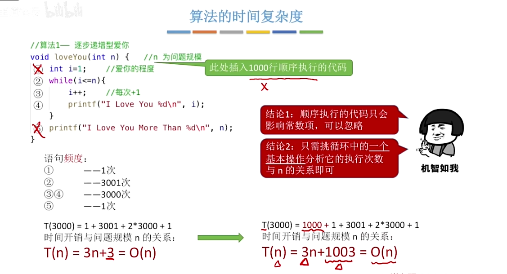

```c
#include <stdio.h>
// 算法一 ———— 逐步递增型爱你
void loveYou(int n){    // n 为问题规模
    int i = 1;  //爱你的程度
    while (i<=n){
        i++;	// i每次+1
        printf("I Love You %d\n", i);
    }
    printf("I Love You More Than %d\n", n);
    
}

int main(){
    loveYou(3000);
	return 0; 
}
```

语句频度：

①		——1次
②    	——3001次
③④     ——3000次
⑤	     ——1次
$$
T(3000) = 1+3001+2*3000+1
$$
时间开销与问题规模 $n$ 的关系：
$$
T(n)=3n+3=O(n)
$$
